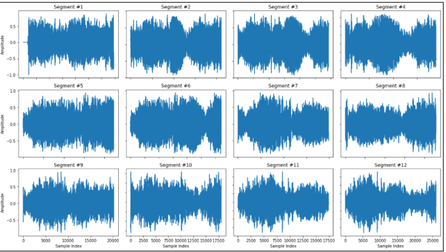

# Respiratory Cycle Segmentation from Audio Signals

🏆 *AIOSP 2022 Hackathon – Problem Statement 1*

---

##  Overview

This repository addresses **Problem Statement 1** of the **AIOSP 2022 Hackathon**, which focuses on the **segmentation and annotation of respiratory cycles** from raw lung sound audio recordings.

Accurate respiratory cycle segmentation is a **critical preprocessing step** for downstream tasks such as respiratory disease classification and abnormal lung sound detection.

👉 [https://iic.ac.in/aiosp-hackathon/](https://iic.ac.in/aiosp-hackathon/)
---

##  Problem Statement

**Segment the respiratory cycles from the given audio files and annotate them accordingly.**

Input:

* Raw lung sound recordings in `.wav` format

Output:

* Individual respiratory cycle segments
* Each segment correctly annotated for further analysis

---

##  Solution Approach

### 1. Audio Preprocessing

* Loaded `.wav` files using audio processing libraries
* Normalized and denoised signals where required
* Converted raw waveforms into suitable representations for segmentation

### 2. Respiratory Cycle Segmentation

* Identified inhalation–exhalation patterns from continuous audio
* Segmented complete respiratory cycles from each recording
* Ensured temporal consistency and accurate boundary detection

### 3. Annotation

* Each extracted respiratory cycle was **appropriately annotated**
* Generated labeled segments suitable for:

  * Disease classification
  * Crackle / wheeze detection

---

##  Sample Output

**Figure 1. Sample Segments of Respiratory Cycles**

The figure below illustrates representative respiratory cycles extracted from the original audio recordings, demonstrating clear separation of individual breathing patterns.


```

```

---

##  Implementation & Results

The complete implementation, along with visualizations and segmentation results, is available in the Google Colab notebook below:

 **Google Colab Notebook**
 [https://colab.research.google.com/drive/13EXSjYrrm0M2nSWGJVr13bxcVW75KADM](https://colab.research.google.com/drive/13EXSjYrrm0M2nSWGJVr13bxcVW75KADM)

The notebook includes:

* Audio loading and visualization
* Respiratory cycle segmentation logic
* Annotated segment outputs
* Intermediate plots and analysis

---

##  Tech Stack

* **Programming Language:** Python
* **Audio Processing:** Librosa, SciPy
* **Numerical Computing:** NumPy
* **Visualization:** Matplotlib
* **Development Environment:** Google Colab

---

##  Outcome

* Successfully segmented respiratory cycles from raw lung sound recordings
* Produced clean, annotated cycle-level data
* Enabled robust downstream machine learning tasks in later problem statements

---

##  Hackathon Context

* **Hackathon:** AIOSP 2022
* **Achievement:** 🥇 Winner
* **Domain:** Healthcare AI / Audio Signal Processing

---

